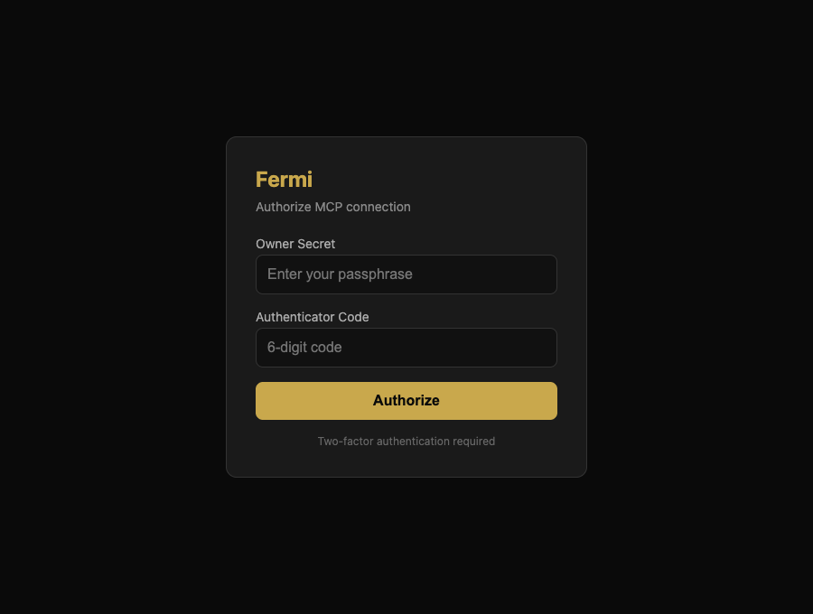

# Fermi

A portable AI control plane built as a single [MCP](https://modelcontextprotocol.io)
server on Cloudflare Workers. Connect it to Claude.ai, Claude Desktop, Claude Code,
Cursor, or ChatGPT and they share the same memory, the same permission model, and the
same skills. For unattended channels (Telegram, Slack) it runs its own inference loop
against the Anthropic API.

One server, one memory, one permission spine — the host changes, the agent doesn't.

> Architecture in depth: [`docs/ARCHITECTURE.md`](docs/ARCHITECTURE.md).
> Setup and day-to-day usage: [`docs/USAGE.md`](docs/USAGE.md).

## What it does

- **Cross-host memory** — facts, preferences, and events in D1, recalled from any
  connected host. A nightly job summarizes sessions, de-duplicates near-identical
  memories by embedding similarity, and decays stale ones.
- **Skills** — procedures stored as versioned `SKILL.md` documents in R2 with metadata
  in D1. You can author them directly or promote them from a memory; a weekly job
  proposes draft skills from recent session summaries for you to refine.
- **Permission spine** — every tool declares a scope and a risk level. High-risk tools
  require a two-phase approval token. Mutating tools are blocked in plan mode. Shell
  code is screened against a blocklist. Every call is audited to D1.
- **Hooks** — declarative, glob-matched deny-gates that run before a tool, evaluated
  with `deny > ask > allow` precedence (today `deny` is the enforced decision).
- **Unified search** — Reciprocal Rank Fusion (k=60) over capabilities, skills,
  memories, and message history, blending keyword, FTS5, and Vectorize semantic lanes.
- **Code mode** — the `execute` tool runs JavaScript in an isolated Worker sandbox
  where capabilities are reachable as `codemode.<name>(...)`. Outbound HTTP goes
  through a gateway that injects secrets and enforces per-secret host allow-lists.
- **Dual-lane browser** — a headless cloud lane (Cloudflare Browser Rendering) for
  scraping and a headed local lane (a macOS bridge over Cloudflare Tunnel) for sites
  that need a real hardware fingerprint and authenticated state.
- **Channels & subagents** — Telegram and Slack webhooks with their own inference
  loop; `team_spawn` runs role-prompted subagents.
- **Live Canvas** — agent-driven UI over a Durable Object + WebSocket, persistent
  across turns and hosts.

## Architecture at a glance

```
 MCP Hosts ─┐
 Channels ──┼──► Cloudflare Worker ──► D1 · R2 · KV · Workers AI · Vectorize
 Cron ──────┘     (FermiMCP + 3 DOs)
```

- **Worker** (`src/index.ts`) routes MCP (`/mcp`, `/sse`), channels, OAuth, the
  `/apps/*` host, the canvas WebSocket, and cron dispatch. When `FERMI_AUTH_ENABLED`
  is `true`, an OAuth provider gates the MCP transports; otherwise they are open.
- **Durable Objects**: `FermiMCP` (the agent, SQLite-backed), `LiveCanvasDO`,
  `SandboxStorageDO`, `BrowserSessionDO`.
- **Storage**: D1 (memory, sessions/messages + FTS5, audit, hooks, skills metadata,
  secrets metadata, oauth), R2 (skills, files, apps), KV (config, approval tokens),
  Workers AI (embeddings + summaries), Vectorize (semantic index).

See [`docs/ARCHITECTURE.md`](docs/ARCHITECTURE.md) for the full diagram and data flow.

## Two tool surfaces

Fermi exposes tools at two layers, and they are deliberately not identical:

| Surface | Caller | Count |
|---------|--------|-------|
| **MCP tools** | connected hosts and channels | ~60 by default, ~85 with the macOS bridge enabled |
| **Sandbox capabilities** | code passed to `execute`, as `codemode.<name>(...)` | 39 (`meta_list_capabilities`) |

MCP tools by group (host-facing):

| Group | Tools |
|-------|-------|
| Memory | `memory_recall`, `memory_write`, `memory_update`, `memory_delete`, `memory_list_recent` |
| Skills | `skill_search`, `skill_load`, `skill_set`, `skill_delete` |
| Search | `search` (unified RRF), `session_search` |
| Code mode | `execute` |
| Filesystem | `fs_read`, `fs_write`, `fs_list` (R2, scope-checked) |
| Browser (cloud) | `browser_navigate`, `browser_screenshot`, `browser_extract`, `browser_action` |
| Browser sessions | `browser_session_launch`, `browser_session_action`, `browser_session_close`, `browser_session_list`, `browser_session_request_human`, `browser_session_resume` |
| Canvas | `open_generated_ui`, `canvas_update` |
| Plan mode | `session_set_mode`, `plan_draft`, `plan_approve` |
| Team | `team_spawn` |
| Hooks | `hooks_register`, `hooks_list`, `hooks_test` |
| Secrets | `secret_set`, `secret_list`, `secret_delete`, `secret_resolve`, `secret_approve_host` |
| Meta | `meta_list_capabilities`, `usage_stats` |
| Connectors | `connector_set`, `connector_get`, `connector_list`, `connector_delete` |
| Packages | `package_set`, `package_get`, `package_list`, `package_delete` |
| Retrievers | `retriever_set`, `retriever_run`, `retriever_get`, `retriever_list`, `retriever_delete` |
| OAuth | `oauth_register_client`, `oauth_get_client`, `oauth_list_clients`, `oauth_delete_client`, `oauth_authorize_url`, `totp_setup` |
| macOS bridge (optional) | 25 `mac_*` tools, registered only when `MACOS_MCP_URL` is set |

## Quick start

```bash
git clone <repo-url> fermi && cd fermi
bun install
wrangler login

chmod +x bootstrap.sh
./bootstrap.sh my-instance-name        # provisions D1, R2, KV, Vectorize; writes wrangler.jsonc

cd packages/worker
wrangler secret put FERMI_SECRETS_KEY   # required: encrypts stored secrets
wrangler secret put FERMI_OWNER_SECRET  # owner password for the OAuth consent screen
wrangler secret put FERMI_BEARER_TOKEN  # gates the admin HTTP endpoints
bun run migrate:remote
wrangler deploy --var FERMI_AUTH_ENABLED:true
```

> ⚠️ Deploy with `FERMI_AUTH_ENABLED:true` (or set it in `wrangler.jsonc` `vars`).
> Without it the MCP transports are **completely unauthenticated** on a public
> `workers.dev` URL — anyone who finds it can read your memories, resolve your
> stored secrets, and run code. Open mode is for `wrangler dev` only.

Then seed the bundled skills and confirm the capability registry:

```bash
curl -X POST https://<worker>/admin/seed-skills -H "Authorization: Bearer $FERMI_BEARER_TOKEN"
curl https://<worker>/capabilities             -H "Authorization: Bearer $FERMI_BEARER_TOKEN"
```

Full instructions, including auth modes and channel setup, are in
[`docs/USAGE.md`](docs/USAGE.md).

### Prerequisites

- [Bun](https://bun.sh)
- [Wrangler](https://developers.cloudflare.com/workers/wrangler/) (`bun add -g wrangler`)
- A Cloudflare account on the Workers Paid plan ($5/mo) — required for Durable
  Objects, Browser Rendering, and Vectorize

### Development

```bash
bun run dev            # wrangler dev --local
bun run check          # Biome lint + format check
bun run format         # auto-format
bun run migrate:local  # apply D1 migrations locally
bun run test           # vitest (worker package)
```

## Configuration

Secrets are set with `wrangler secret put` (values entered interactively):

| Secret | Required | Purpose |
|--------|----------|---------|
| `FERMI_SECRETS_KEY` | yes | Encryption key for the secrets store |
| `FERMI_OWNER_SECRET` | when `FERMI_AUTH_ENABLED=true` | Owner password for the OAuth consent screen and `/apps/*` login |
| `FERMI_BEARER_TOKEN` | for admin HTTP endpoints | Gates `/capabilities`, `/cron/capability-reindex`, `/admin/seed-skills` |
| `ANTHROPIC_API_KEY` | for channels / `team_spawn` | Inference loop for unattended use |
| `TELEGRAM_BOT_TOKEN` | optional | Telegram channel |
| `SLACK_BOT_TOKEN`, `SLACK_SIGNING_SECRET` | optional | Slack channel |
| `MACOS_MCP_URL`, `MACOS_MCP_TOKEN` | optional | Local macOS bridge (enables the `mac_*` tools) |

Auth mode is controlled by the `FERMI_AUTH_ENABLED` var. Set it to `true` to put the
MCP transports behind OAuth — recommended for every deployed instance. Leaving it
unset serves `/mcp` and `/sse` with no authentication, which is only appropriate for
local `wrangler dev`.

In OAuth mode, connecting hosts self-register and land on Fermi's consent screen,
which validates your owner secret and (once enrolled via `totp_setup`) a TOTP code:



## Connecting a host

### Claude.ai (web)

Settings → Connectors → add a custom connector, URL
`https://<worker>/sse`.

### Claude Desktop / Cursor / VS Code

```json
{ "mcpServers": { "fermi": { "url": "https://<worker>/mcp" } } }
```

### Claude Code

```bash
claude mcp add fermi --transport http https://<worker>/mcp
```

## Cost

Single-user, expect ~$8–20/month: the Workers Paid plan ($5) plus variable Browser
Rendering and Anthropic API usage. D1/R2/KV/Vectorize stay near the free tier at this
volume. MCP hosts pay for their own inference; Fermi only spends on model calls in
unattended channels and `team_spawn`.

## License

MIT
</content>
