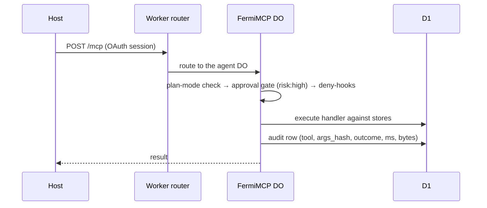
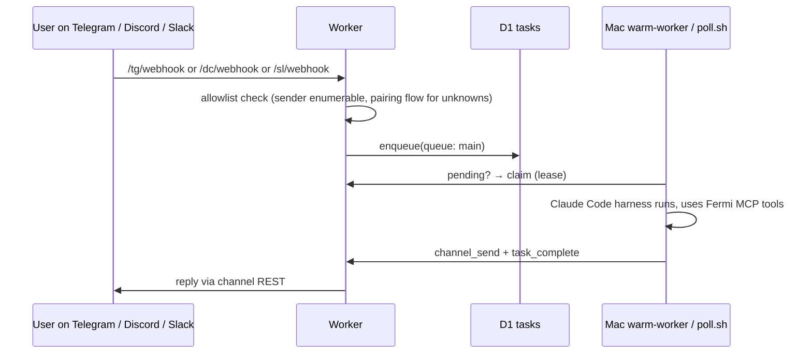
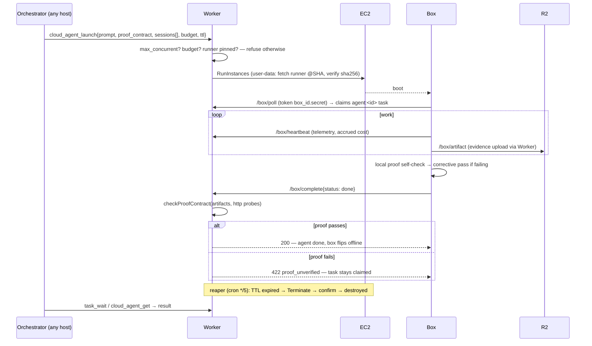
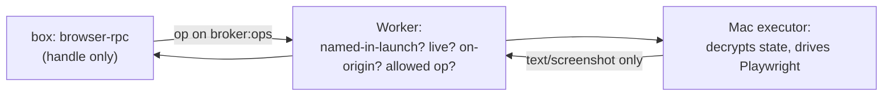
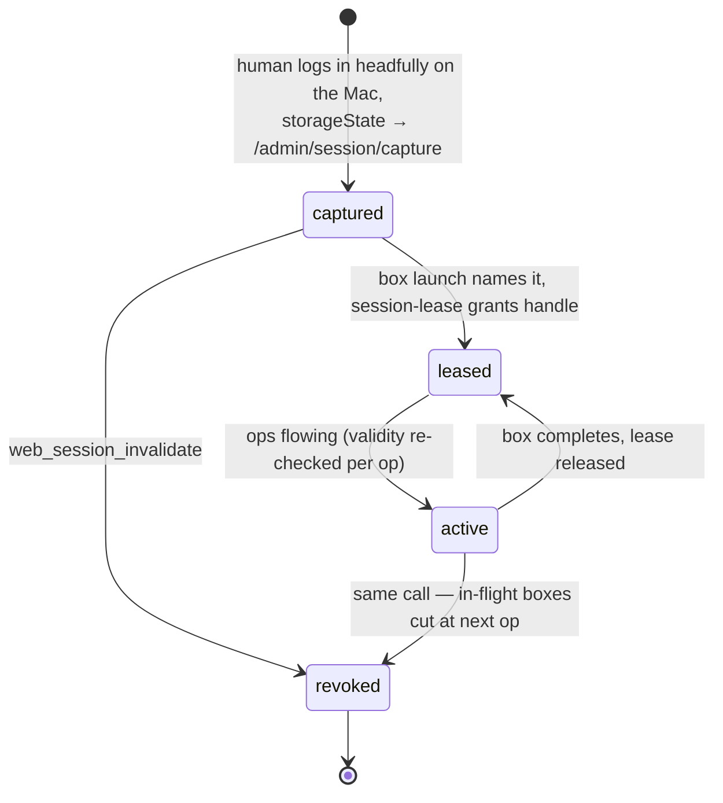
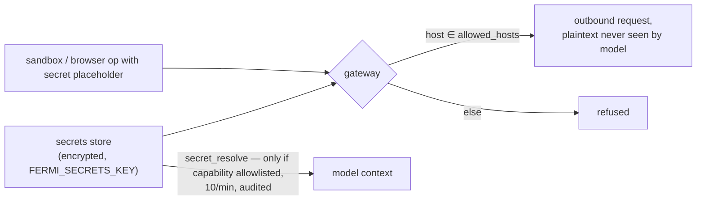
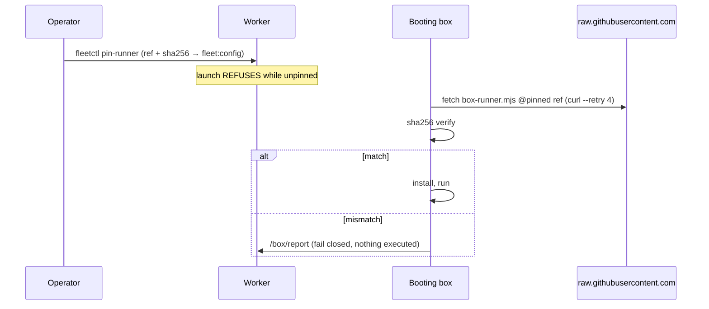
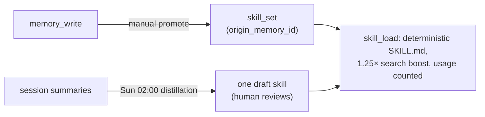

# Data flows, state by state

Each lifecycle in the system, as the data actually moves. Conventions: every diagram names its enforcement points; anything crossing a trust boundary says what crosses. If a flow isn't here, it doesn't exist.

[[toc]]

## 1. MCP tool call (any host)

State machine for a `risk: high` call: `no token → pending_approval (token minted, KV TTL 300s) → host retries with token → token deleted (single use) → executed`.

## 2. Channel message → reply

## 3. Neutrino: launch → proof → terminate

## 4. Brokered browser op (box ↔ your logged-in session)

See [the session broker](/components/session-broker) for the full sequence. Compressed:

Four 403s guard the door: `session_not_in_launch`, `session_invalid`, `origin_not_allowed`, `op_not_yours`.

## 5. Session capture → invalidation

## 6. Secret injection

## 7. Runner pin (supply chain)

## 8. Memory → skill crystallization

## Invariants (the whole system)

- Only the Worker is publicly addressable; Macs pull or sit behind an authenticated tunnel; boxes only dial home.
- Cookies decrypt in exactly one process (the Mac executor). Boxes see handles and op results.
- A box's token opens `/box/*` for that box only — never `/admin/*`, never another box's ops.
- `done` is a claim until the proof contract verifies; honest failure is always accepted.
- Nothing boots on a box that doesn't hash to the pinned sha256.
- Fleet queues (`agent:*`, `broker:*`) are invisible to the channel drain.
- Every tool call, approval, and secret resolution leaves an audit row.
