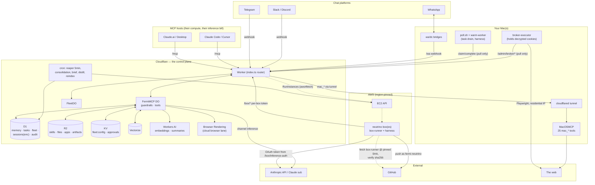

# System map

Every piece of compute and every storage service in a full (Tier 5) deployment, and which direction data moves between them. Solid arrows are runtime data paths; dashed are boot/provision-time.

## Who pays for inference, by lane

| Lane | Model runs on | Billed to |
|------|---------------|-----------|
| MCP hosts | the host (Claude.ai, Claude Code…) | your existing subscription |
| Channels (Telegram/Discord/WhatsApp/Slack) | Claude Code on your Mac (daemon drain) | your subscription |
| Daemon tasks | Claude Code on your Mac | your subscription |
| Neutrinos | harness on the box, OAuth token | your subscription (tracked as telemetry `inference_usd`, **not** counted against the fleet budget — the budget is EC2 wall-clock only) |

## Public addresses

Exactly one component listens on the internet: the Worker. The Mac is reachable only through its outbound tunnel (Tier 3+) or not at all (Tier 2). Boxes have public IPs for egress but expose no service; every box interaction is the box calling the Worker.

## Reading order

1. This page, then [Data flows, state by state](/architecture/data-flows) for each lifecycle in sequence-diagram form.
2. [Trust boundaries](/architecture/trust-boundaries) for where credentials live and stop.
3. Component pages for the runtime model of each box above.
