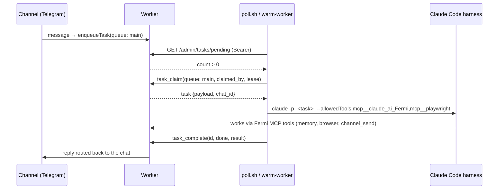

# The Daemon

**Status:** Tier 2. Repo: [fermi-daemon](https://github.com/abel30567/fermi-daemon). A set of small processes on your Mac that turn the Worker's task queue into real work done by a real coding harness.

## The core idea

The Worker cannot run Claude Code. Your Mac can. The daemon closes that gap **pull-only**: the Mac calls out to the Worker, claims tasks, runs the harness locally, and completes them. Without MacOSMCP, nothing on the internet can push into your Mac — the daemon holds an outbound bearer token, no inbound port.



## What runs (who owns what)

| Process | File | Owns |
|---------|------|------|
| Poller | `poll.sh` | lane-based task drain: claims from its queue, spawns a fresh harness per task, completes with the result |
| Warm worker | `warm-worker.mjs` | latency: keeps one harness pre-booted so the first token of a reply is seconds, not a cold boot; drains `main` |
| Channel bridges | `wa-bridge`, `dc-bridge` (in fermi-mcp `packages/`) | sockets a Worker can't hold (WhatsApp Web); relay to Worker webhooks |
| Broker executor | `tools/broker-executor.mjs` | **the only process anywhere that sees decrypted cookies**; drives Playwright for fleet browser ops — see [Session broker](/components/session-broker) |
| Session capture | `tools/capture-session.mjs` | logs into a site headfully once, ships `storageState` to `/admin/session/capture` |
| Box runner | `box-runner.mjs` | not run on the Mac — this is the file neutrinos boot; it lives here so it can be SHA-pinned from one repo |

## With vs. without MacOSMCP

| | Daemon only (Tier 2) | + MacOSMCP (Tier 3) |
|---|---|---|
| Direction | Mac pulls tasks | Worker can also push tool calls in |
| Latency | queue poll (seconds) | live round-trip |
| Surface | what your task prompt allows the harness | 25 `mac_*` tools for any connected host |
| Inbound exposure | none | Cloudflare Tunnel + `MACOS_MCP_TOKEN` |
| Typical use | "fix issue #12 and open a PR" from Telegram | "log into the vendor portal and screenshot the invoice" from your phone |

They compose: the reference deployment runs both. Tier 2 handles queued work; Tier 3 handles interactive control. The daemon's harness itself connects to Fermi over MCP, so queued tasks still get memory, skills, secrets, and channels.

## Setup

```bash
git clone https://github.com/abel30567/fermi-daemon && cd fermi-daemon
cp .env.example .env    # FERMI_URL, FERMI_BEARER_TOKEN, lane/queue names
bun install             # playwright, for the broker executor
./poll.sh               # or install the launchd plists for boot persistence
node warm-worker.mjs    # optional but worth it
```

## What success looks like

- [ ] Message your Telegram bot; a reply arrives produced on your Mac
- [ ] `task_list(status: done)` shows the task claimed by your daemon's identity
- [ ] Kill the daemon mid-task: the lease expires and the task becomes claimable again (no lost work)

## Failure modes

| Symptom | Cause | Fix |
|---------|-------|-----|
| Tasks pile up pending | daemon not running / wrong queue name | check lane config vs. enqueue queue |
| Replies from "root" or wrong git author | harness env leaks through | daemon exports `GIT_AUTHOR_*`/`GIT_COMMITTER_*`; see [Committing as root](/blog/06-committing-as-root) |
| Fleet tasks stolen by your Mac | you're on a pre-Sep-2026 worker | update: fleet queues are excluded from the channel drain |
| Two broker executors fighting | you ran it on two Macs | exactly one owns the browser profiles; kill the rest |
