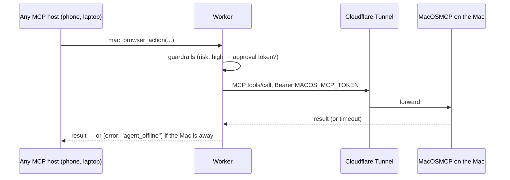

# MacOSMCP

**Status:** Tier 3, optional. Repo: [MacOSMCP](https://github.com/abel30567/MacOSMCP). A standalone MCP server for macOS control, fronted by a Cloudflare Tunnel, bridged into the Worker's tool surface.

## Why it exists

The cloud browser lane (Cloudflare Browser Rendering) is a datacenter IP with an automation fingerprint. Half the interesting web — banks, retailers, anything behind Cloudflare Turnstile or PerimeterX — treats it accordingly. Your Mac has what those sites trust: a residential IP, a real Chrome profile, real input events, hardware attestation. MacOSMCP turns that into tools.

## Tool families (25 `mac_*` tools)

| Family | Tools | Risk |
|--------|-------|------|
| Shell & scripts | `mac_shell`, `mac_applescript`, `mac_jxa` | high, approval-gated |
| Browser | `mac_browser_launch/action/list/close` — real (non-headless) Chrome with stealth | med-high |
| Vision | `mac_screenshot`, `mac_screen_ocr` (Vision framework) | low |
| Files | read/write/list/move/delete/search/info | med |
| Input | `mac_keystroke`, `mac_click` | high |
| System | app activate/list, clipboard get/set, `mac_open`, notifications, system info | low-med |

## How the bridge works



The Worker registers `mac_*` tools **only when `MACOS_MCP_URL` is set** — no Mac configured, no tools listed. The bridge caches the MCP handshake and degrades to `agent_offline` instead of throwing when the tunnel is down.

## Setup

```bash
git clone https://github.com/abel30567/MacOSMCP && cd MacOSMCP
# follow README: bun install, grant Accessibility + Screen Recording
cloudflared tunnel create fermi-mac       # or use a named tunnel you have
# point the tunnel at the local MCP port, then on the Worker:
bunx wrangler secret put MACOS_MCP_URL    # https://<tunnel-host>
bunx wrangler secret put MACOS_MCP_TOKEN  # long random string, same on both ends
```

macOS will prompt for Accessibility (keystrokes/clicks), Screen Recording (screenshot/OCR), and Automation (AppleScript per-app) permissions the first time each capability is used. Grant them to the process that runs the server, not your terminal du jour, or they reset on every launch path change.

## The line this component draws

MacOSMCP makes your Mac *drivable*. Two boundaries keep that sane:

1. Everything arrives through the Worker's guardrail pipeline — shell/script/input tools are `risk: high` and demand an approval round-trip.
2. It's still **your** session: the stealth browser uses persistent profiles you logged into yourself. Fermi's stance on bot walls is to *be* the human's own device, never to defeat human-verification challenges — where a site says "prove you're human," a human does. See [Bot walls](/blog/07-bot-walls).
