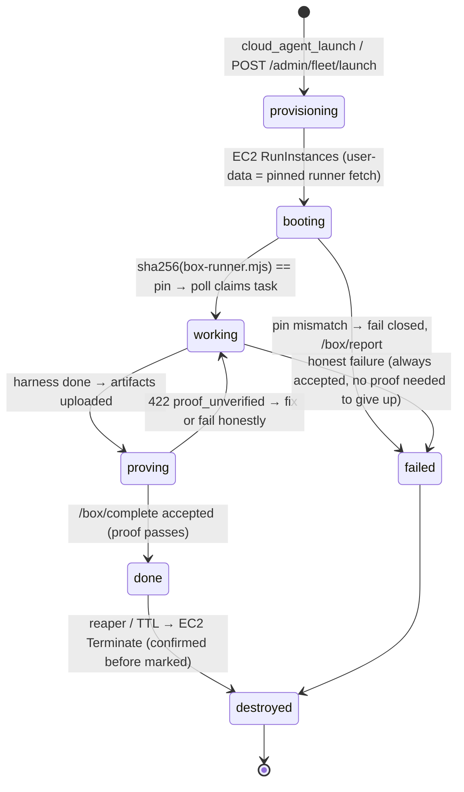

# Neutrinos: the cloud fleet

**Status:** Tier 4. Code: worker `src/lib/fleet-*`, `src/channels/box-gateway.ts`, `src/do/fleet-do.ts`, `src/cron/fleet-reaper.ts`; boot script `box-runner.mjs` in fermi-daemon. Verified at 100 concurrent agents.

A **neutrino** is a disposable EC2 box born for one task: it boots, claims its task from the Worker, runs a coding harness, uploads evidence, satisfies a machine-checked proof contract, and terminates. You never SSH into one. You never keep one.

## Lifecycle



## How a launch flows through the system

1. **Any MCP host** (or the daemon, or another agent) calls `cloud_agent_launch` with:

```jsonc
{
  "prompt": "Add a gradient() function to testbed with tests",
  "proof_contract": "{\"kind\":\"artifact\",\"name\":\"out.diff\",\"min_bytes\":1}",
  "route": "claude",          // or "codex" | "grok"
  "budget_usd": 0.25,          // soft cap, EC2 wall-clock only
  "ttl_seconds": 3600,
  "skills": ["github-api"],    // Fermi skills preloaded into the box context
  "sessions": ["gmail"],       // web sessions the box may lease — named or nothing
  "repo": "you/testbed", "branch": "agent/gradient"
}
```

2. The Worker enqueues the task on a private queue `agent:<id>`, checks `max_concurrent` and the monthly budget, and calls EC2 `RunInstances` (signed with your AWS keys from the secrets store, via `aws4fetch` — no SDK). User-data contains only the **pinned fetch**: download `box-runner.mjs` at a specific commit SHA, verify its sha256 against the pin, refuse to run otherwise.
3. The box authenticates every call with its **per-box token** `<box_id>.<secret>` (hashed at rest) against the `/box/*` gateway: `poll` → claim the task, `heartbeat`, `artifact` (upload evidence to R2), `inference-auth` (fetch the Claude OAuth token), `session-lease` (broker handle, never cookies), `complete`, `report` (crash telemetry — every fatal path phones home).
4. The runner sets the git identity to `fermi-neutrino` — machine commits are visibly machine commits — runs the chosen harness, auto-generates `out.diff` if the agent forgot, and self-checks the proof contract locally *before* submitting, running one corrective pass if it would fail.
5. `/box/complete` re-checks the proof contract **server-side** (`lib/proof-contract.ts`). `done` without satisfiable proof → HTTP 422, task stays claimed, the box may fix its work or fail honestly. Honest failure is always accepted.
6. The reaper cron (every 5 min) terminates TTL-expired boxes and only marks them `destroyed` after EC2 confirms.

## Proof contracts

Free-text "definition of done" invites confident lying (["Agents lie"](/blog/02-proof-contracts)). Contracts are structured JSON, checked mechanically:

| kind | Checked by worker | Example |
|------|-------------------|---------|
| `artifact` | existence, `min_bytes`, `sha256` in R2 | `{"kind":"artifact","name":"out.diff","min_bytes":1}` |
| `http` | `expect_status`, `body_matches` | health endpoint returns 200 |
| `test` | unverifiable worker-side → completes tagged `completed_unverified` for orchestrator replay | `{"kind":"test","cmd":"npm test"}` |
| `dom` | same as `test` | selector/text match on a page |

Legacy free-text contracts are grandfathered; new launches should always pass structured JSON.

## What access this tier needs (and nothing more)

| Grant | Why | Scope it |
|-------|-----|----------|
| AWS access key pair | `RunInstances`/`TerminateInstances`/`DescribeInstances` | IAM policy limited to those actions, one region, your fleet security group |
| `CLAUDE_CODE_OAUTH_TOKEN` in Fermi secrets | boxes inference on your existing Claude subscription — **inference is not billed to the budget**, EC2 wall-clock is | it's your sub; rotate from your Anthropic account |
| `GITHUB_TOKEN` in Fermi secrets | clone/push/PR | fine-grained token, only the repos agents work |
| `fleet:config` in KV | region, instance type, `max_concurrent`, `monthly_budget_usd`, `runner_ref`+`runner_sha256`, TTLs | set via `fleetctl` or KV directly |

Cost intuition: a `t3.small` is $0.0208/hr. The 100-agent run (~6 minutes median per box) cost about **$1.60 of EC2** and zero marginal inference.

## Operating it

```bash
fleetctl pin-runner        # after ANY box-runner.mjs change — launch refuses unpinned
cloud_agent_launch ...     # from any host
cloud_agent_list / get     # status, exit_reason, accrued cost, inference telemetry
cloud_agent_followup       # send a follow-up prompt to a live box
cloud_agent_stop / destroy # manual kill switch
```

## Failure modes

| Symptom | Cause | Fix |
|---------|-------|-----|
| `launch refuses: runner not pinned` | intended | `fleetctl pin-runner` |
| Box never boots, no report | CDN throttled the runner fetch under burst | fixed: runner fetch retries 4× ; check `/box/report` telemetry |
| `422 proof_unverified` loops | contract genuinely unsatisfiable | fix the contract, or let the box fail honestly |
| Fleet tasks claimed by your Mac | ancient worker | update — fleet queues are drain-isolated |
| Cost above budget | soft cap raced between polls | budgets bound *expected* spend; TTL bounds worst case |
