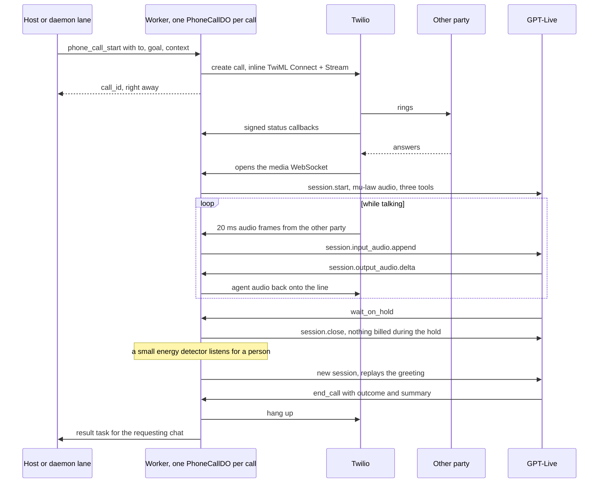
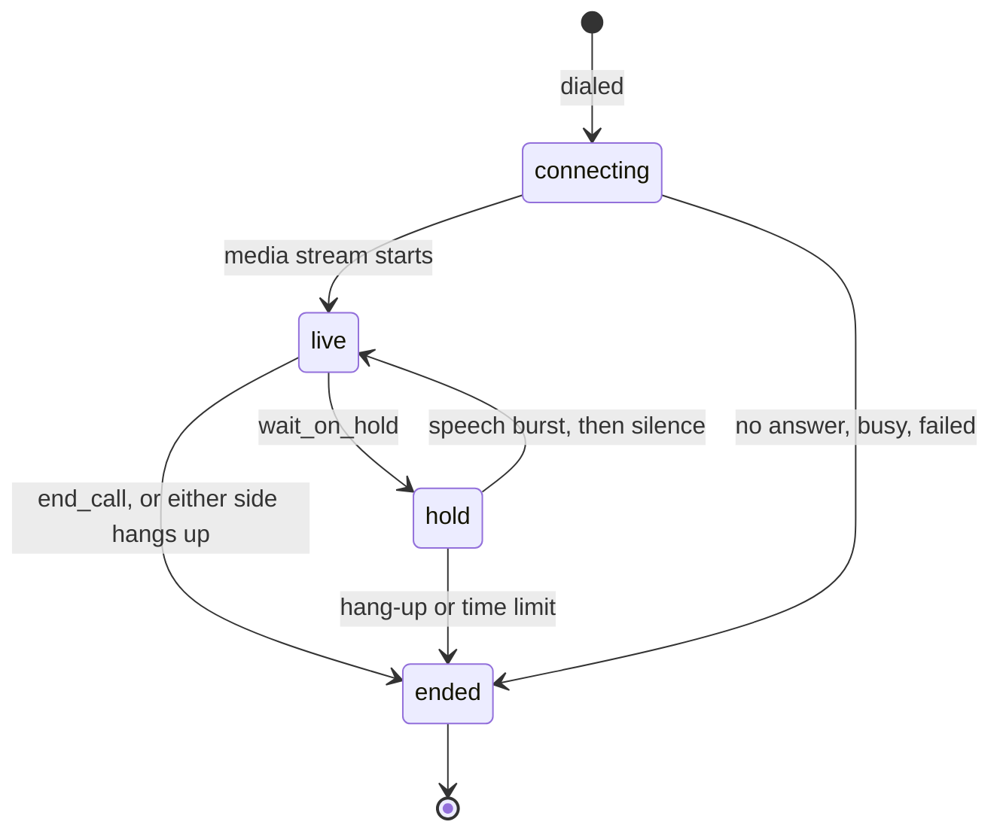

# Phone calls

**Status:** shipped (worker `src/do/phone-call.ts`, `src/lib/phone-call.ts`, `src/lib/phone-hold.ts`, `src/mcp/tools/phone.ts`). Optional: nothing else in Fermi depends on it, and the tools report `phone_not_configured` until you add the accounts below.

Fermi can place a real phone call with a goal — "call the IRS, wait on hold, ask for a first-time penalty abatement" — and report back what was said. Twilio carries the call. OpenAI's GPT-Live voice model does the talking. One Durable Object per call sits between them, and it is the part that makes long calls affordable: **while the line is on hold, the voice model is disconnected**, and it is only brought back when a person picks up.

## Accounts you need

Three accounts are involved. Fermi itself already requires the first.

| Account | What it does here | What Fermi needs from it |
|---------|-------------------|--------------------------|
| **Cloudflare** (Workers Paid) | runs the Worker and the per-call Durable Object | the `PHONE_CALL` binding (in `wrangler.template.jsonc`) |
| **Twilio** (upgraded, not trial) | dials the number and streams the call audio to the Worker | Account SID, Auth Token, a caller ID |
| **OpenAI** (API, with GPT-Live access) | the voice model on the line, plus a small text model that runs the call's tools and writes summaries | an API key |

### Twilio: four things a new account must have

A fresh Twilio account cannot place these calls. Each missing step fails at dial time with a different error, which Fermi returns verbatim in the `error` field of `phone_call_start`. Work through them in order.

| # | Requirement | Where in the Twilio Console | Error you get without it |
|---|-------------|-----------------------------|--------------------------|
| 1 | **Upgrade out of trial.** Trial accounts may only run Twilio's own demo templates; media streams are blocked. | Billing → upgrade, add funds | `400 Invalid or disallowed parameters provided - trial accounts have limited parameter access` |
| 2 | **An approved primary customer profile** (Twilio's identity check). | Trust Hub → Profiles | `401 Primary compliance profile is not approved … (code 20003)` |
| 3 | **Voice geo-permissions for the country you call.** New accounts can start with every country switched off, including your own. Enable only the standard ("low-risk") category. | Voice → Settings → Geo permissions | `400 Account not authorized to call +1… (code 21215)` |
| 4 | **A caller ID.** Either buy a Twilio number, or verify a number you already own so calls show that number. | Phone Numbers → Buy a number, or Phone Numbers → Verified Caller IDs | `'From' phone number not verified (code 21210)` |

Then copy the **Account SID** and **Auth Token** from the Console dashboard. The Auth Token does double duty: Fermi uses it to call Twilio's API, and to verify that status callbacks really came from Twilio. If you rotate it, update the stored secret.

::: tip Using your own mobile number as caller ID
A number on a consumer mobile plan has no API, so software cannot dial out through it. Verifying it as a Twilio **Verified Caller ID** gets the same visible result: the call goes out through Twilio but shows your number, and callbacks ring your phone.
:::

### OpenAI

- An API key on a project that can use the **Live API** and the `gpt-live-1` model. GPT-Live is not available on the free tier. Check with:

  ```bash
  curl -s https://api.openai.com/v1/models/gpt-live-1 -H "Authorization: Bearer $OPENAI_API_KEY"
  ```

- Access to a Responses-API text model for the call's tools and summaries. The default is `gpt-6-luna`; any tool-capable model works.

## Configuration

Store these with `secret_set` (scope `app`) from any connected host — no redeploy needed. Worker vars or secrets with the same names are the fallback.

| Name | Value |
|------|-------|
| `TWILIO_ACCOUNT_SID` | Twilio Account SID |
| `TWILIO_AUTH_TOKEN` | Twilio Auth Token |
| `TWILIO_FROM_NUMBER` | caller ID in E.164 form, for example `+15551230000` |
| `OPENAI_API_KEY` | OpenAI API key |
| `FERMI_PUBLIC_URL` | the Worker's public origin, for example `https://fermi.example.workers.dev`. Twilio must be able to reach it. |
| `OPENAI_LIVE_MODEL` | optional, default `gpt-live-1` |
| `OPENAI_LIVE_BACKEND_MODEL` | optional, default `gpt-6-luna` |
| `OPENAI_LIVE_VOICE` | optional, default `marin` |

If anything required is missing, `phone_call_start` answers `{"error":"phone_not_configured","missing":[…]}` and places no call.

Existing deployments also need the Durable Object binding in their own `wrangler.jsonc` (new deployments get it from the template):

```jsonc
"durable_objects": { "bindings": [ /* … */ { "class_name": "PhoneCallDO", "name": "PHONE_CALL" } ] },
"migrations": [ /* … */ { "new_sqlite_classes": ["PhoneCallDO"], "tag": "v6" } ]
```

There is no D1 migration. Each call's state lives in its Durable Object.

## The tools

| Tool | Risk | What it does |
|------|------|--------------|
| `phone_call_start` | high (approval token) | Dials and returns a `call_id` immediately. The call then runs on its own. |
| `phone_call_status` | low | Status, phase, outcome, summary, transcript, and event log. `wait_seconds` (up to 120) long-polls until the call ends. |
| `phone_call_hangup` | medium | Ends the call. |

`phone_call_start` arguments:

| Argument | Notes |
|----------|-------|
| `to` | number to call, E.164 |
| `goal` | what the call should achieve, in plain language |
| `context` | facts the agent may use: who it is calling for, reference numbers, dates, a callback number. **Everything here can be spoken aloud to whoever answers.** |
| `notify_channel`, `notify_chat_id` | optional; where to deliver the result when the call ends (see [the daemon](#through-the-daemon-s-channels)) |
| `max_minutes` | hard cap including hold time; default 90, maximum 240 |

## How a call works



Twilio and GPT-Live both speak 8 kHz G.711 μ-law, so audio frames pass through the Worker untouched in both directions. No transcoding, no resampling.

### The phases of a call



### What the voice model can do

GPT-Live handles the conversation itself. For anything that is an *action*, it delegates to a backend text model (OpenAI calls this Responses delegation), which calls one of three tools that the Durable Object executes:

| Tool | When | What happens |
|------|------|--------------|
| `send_dtmf` | an automated menu asks for a key press | Twilio plays the digits into the call |
| `wait_on_hold` | hold music, "please stay on the line", an estimated wait | the GPT-Live session is closed |
| `end_call` | the goal is met or cannot be met | the outcome and a summary are saved, then the call is hung up |

The voice agent has **no access to Fermi's memory or other tools** during a call. It knows only the `goal` and `context` it was started with. Whoever starts the call — you, or a daemon lane — gathers the facts first.

### Hold: why the model is disconnected

GPT-Live bills per second of open session, and a government hold can last an hour. So when the model reports a hold:

1. The Durable Object closes the GPT-Live session and stops sending audio to the line.
2. It keeps watching the incoming audio with a cheap energy measure — no model involved. Hold music is continuous. A person who picks up says something and then goes quiet, waiting.
3. A speech-like burst of at least 400 ms followed by 1.2 s of silence reopens GPT-Live. The Durable Object replays that utterance so the model hears the greeting it missed, and the conversation continues with the transcript so far in its instructions.
4. A false alarm — a recorded "your call is important to us" followed by a pause — is cheap: the model hears it, calls `wait_on_hold` again, and a 20-second cooldown stops it from looping.

### Phone menus

Twilio has no "press a key" API for a call whose audio is being streamed. `send_dtmf` therefore replaces the call's instructions with "play these digits, then reconnect the stream". The media stream drops and comes back on a new WebSocket, a gap of a second or two. The Durable Object expects this, keeps the GPT-Live session open across it, and only ends the call if the stream has not returned within 20 seconds.

### Voicemail

Unless the `goal` or `context` says to leave a message, the agent hangs up as soon as it recognizes voicemail. A recorded message cannot be taken back, so it is opt-in.

### How a call ends

| `outcome` | Meaning |
|-----------|---------|
| `success`, `partial`, `failed`, `voicemail`, `wrong_number`, `callback_later` | the agent ended the call with `end_call` and chose this |
| `remote_hangup` | the other party hung up first |
| `no_answer`, `busy`, `canceled`, `failed` | the call never connected (Twilio's final status before anyone answered) |
| `timeout` | `max_minutes` was reached |
| `cancelled` | you called `phone_call_hangup` |
| `dial_failed` | Twilio refused the call; the reason is in `error` |
| `live_error`, `live_unavailable` | GPT-Live rejected the session or could not be reached |
| `stream_lost` | the audio stream dropped and did not come back |

Every ended call that had a conversation gets a **summary**. `end_call` writes it directly; if the call ended any other way, the Durable Object asks the backend model to write one from the transcript, so you never get a bare transcript.

## Through the daemon's channels

From WhatsApp, Slack, Discord, or Telegram, a call is a two-part job, because a daemon lane lives for minutes and a call can last hours:

1. You ask for a call. A lane — which has full Fermi access — confirms the number and what it will say, gathers the facts from memory, and calls `phone_call_start` with your chat as `notify_channel` / `notify_chat_id`. It replies "calling now" and finishes.
2. The call runs inside the Worker. No lane is involved.
3. When it ends, the Durable Object enqueues a task for your chat whose sender is `phone:` followed by the call id, containing the outcome, summary, and the end of the transcript, and wakes the daemon. A fresh lane relays it.

The [fermi-daemon](https://github.com/abel30567/fermi-daemon) drain prompt carries the rules for this: only the owner may request calls, the lane must state who it will call and what it will say and **wait for a yes before dialing**, the agent always identifies as an AI assistant calling on the owner's behalf, and a call transcript is treated as untrusted text to report, never as instructions.

## Who authenticates whom

| Hop | Mechanism |
|-----|-----------|
| Host → Fermi | Fermi's normal OAuth on the MCP transports. `phone_call_start` is additionally high-risk: the first call returns an approval token, the second redeems it. |
| Fermi → Twilio | HTTP Basic with the Account SID and Auth Token |
| Twilio → Fermi, status callbacks (`/phone/webhook`) | `X-Twilio-Signature`: HMAC-SHA1 over the exact callback URL and form fields, keyed by the Auth Token. A bad or missing signature gets `401`. |
| Twilio → Fermi, audio (`/phone/stream/…`) | a random per-call token in the WebSocket path, checked by that call's Durable Object before it accepts the socket. Twilio does not allow query strings on stream URLs, which is why the token is in the path. |
| Fermi → OpenAI | Bearer API key |
| Cloud-agent boxes | cannot use the phone tools; they are not on the box allowlist |

## What it costs

- **GPT-Live**: billed per second of open session — about $0.05 per minute at the time of writing. Hold time is not billed, because the session is closed.
- **Twilio**: per-minute outbound voice for the whole call, including the hold, plus number rental if you bought one.
- **Backend model**: a handful of small tool calls and one summary per call.

## Limits and known gaps

- **Pickup after a hold takes about 5 seconds.** When a person answers after a hold, the model has to be reconnected and has to listen to the replayed greeting before it can reply. With the session already open, replies take about a second.
- **A 1–2 second audio gap follows every key press**, while the stream reconnects.
- **One caller ID per deployment** (`TWILIO_FROM_NUMBER`).
- **Calls are capped at 240 minutes** by `max_minutes`, which matches Twilio's default four-hour limit.
- **The audio is not recorded.** Only the transcript and event log are kept, in the call's Durable Object.
- Real calls have been verified for live conversation, voicemail, and hang-up from either side. Phone menus and holds have been verified against the simulator only.

You are responsible for the rules that apply where you call: consent, automated-call restrictions, and disclosure that the caller is an AI.

## Testing without a carrier

`packages/worker/scripts/phone-sim.mjs` stands in for Twilio on your machine. It serves the call endpoints, sends correctly signed callbacks, and streams a scripted call — a phone menu, hold music, then a person — into a local `wrangler dev`. GPT-Live is real, so a run costs a few cents and shows you the actual behavior: the key press, the hold with the model closed, the pickup, and the summary. It writes a stereo recording and the full call record to `/tmp/fermi-phone-sim/`. The recipe is in [`docs/USAGE.md` §8](https://github.com/abel30567/fermi-mcp/blob/master/docs/USAGE.md).

## Troubleshooting

| Symptom | Check |
|---------|-------|
| `phone_not_configured` | the `missing` list names the secrets to add |
| `dial_failed` with a Twilio message | match it against the [Twilio table](#twilio-four-things-a-new-account-must-have) above |
| `live_error` right after the call connects | the OpenAI key lacks Live API access, or `OPENAI_LIVE_MODEL` / `OPENAI_LIVE_BACKEND_MODEL` names a model the key cannot use |
| The call connects but ends at once with `remote_hangup` and no transcript | Twilio could not open the audio stream: `FERMI_PUBLIC_URL` is wrong or not reachable over `wss` |
| No `call.ringing` / `call.in-progress` entries in `events` | status callbacks are being rejected: `FERMI_PUBLIC_URL` must be exactly the origin Twilio calls, and `TWILIO_AUTH_TOKEN` must be current |
| The agent never goes on hold, or never hangs up | read the `events` in `phone_call_status`: `delegation` shows the voice model asking, `hold_requested` / `end_requested` show the tool running |
| No result message in the chat | `notify_channel` and `notify_chat_id` must both be set when the call starts |
