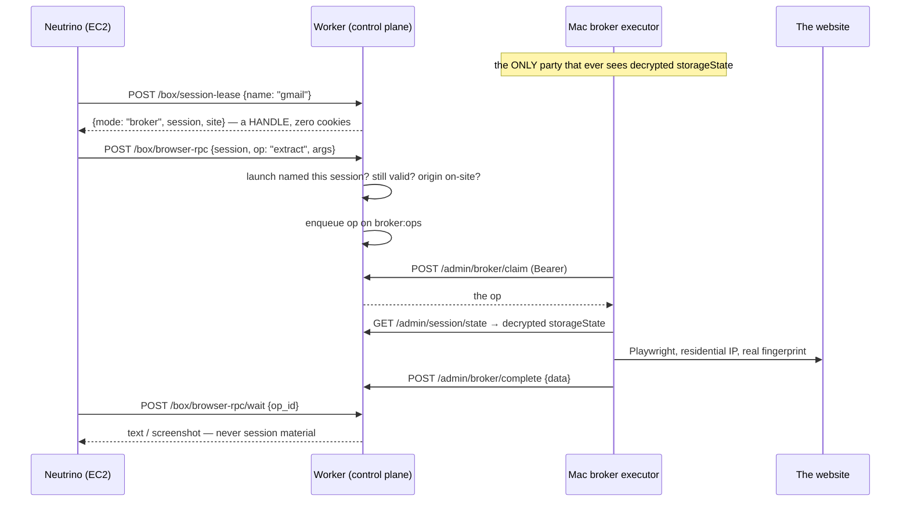

# The session broker

**Status:** shipped (worker `src/channels/broker.ts`, `src/lib/web-session-store.ts`; executor `tools/broker-executor.mjs` in fermi-daemon). The security design that makes Tier 4 tolerable.

## The problem

Fleet agents frequently need *your logged-in web sessions* — check an inbox, drive a dashboard, send a test prompt in a web app. The naive design hands each box your cookies. Now a hundred disposable, internet-connected VMs each hold credentials that can't be revoked without re-logging-in everywhere. No.

## The design: cookies never leave home



## The rules, each with its enforcement point

1. **Handle, not state.** `/box/session-lease` returns `{mode, session, site}` — a leak-witness test asserts the response never contains cookies or a canary value (`test/session-broker.test.ts`).
2. **Launch binding.** A box may only lease sessions **named in its launch** (`sessions: ["gmail"]`). Not named → `403 session_not_in_launch`.
3. **Kill switch on every op.** Session validity (revoked/expired) is re-checked per op, so `web_session_invalidate` severs in-flight boxes at their next action.
4. **Origin allowlist.** Ops must target the session's site (host or subdomain). `https://attacker.example/exfil` → `403 origin_not_allowed`.
5. **No `evaluate` op.** The op set is `goto | click | fill | extract | screenshot`. Arbitrary page JS could read `document.cookie` and exfiltrate the session through the RPC result — the exact leak the broker exists to stop. `extract` is textContent-only.
6. **Box-scoped results.** Another box calling `/box/browser-rpc/wait` on your op id gets `403 op_not_yours`.
7. **One executor.** The Mac executor is the single holder of decrypted state *and* the single owner of persistent browser profiles (needed because anti-bot clearances are fingerprint-bound). Two executors sharing a profile deadlock on the profile lock — run exactly one.

## Capturing a session

```bash
node tools/capture-session.mjs --name gmail --site https://mail.google.com
# opens a headful browser; you log in like a human; storageState ships to
# POST /admin/session/capture and is encrypted at rest in D1
web_session_list / web_session_invalidate   # manage from any host
```

Sessions carry `max_concurrent` (how many boxes may drive one login simultaneously) and expiry. Capture on the same machine that runs the executor: clearance cookies are bound to that browser fingerprint.

## Invariants

- Decrypted `storageState` exists in exactly two places, ever: D1 ciphertext at rest, and the Mac executor's process memory.
- A box's total possible knowledge of your session is: the site name, and the results of allowed ops on allowed origins.
- Revocation is O(one KV/D1 write) and takes effect at every in-flight box's next op.
