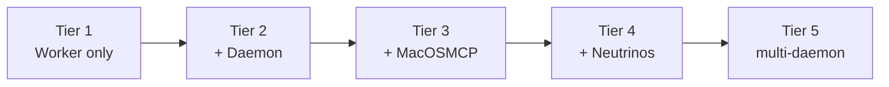

# Setup tiers

Fermi is adopted in tiers. Each tier is fully useful on its own; each adds one trust decision and one operational burden. The rule from tier to tier: **if the current tier can't complete its own success checklist, don't add the next one.**

## Tier 1 — Worker only (easy)

**What you get:** shared memory/skills/secrets across every MCP host, task queue, schedules, channels (Telegram/Slack/Discord/WhatsApp via webhooks), cloud browser (Cloudflare Browser Rendering), the `execute` sandbox.

**You grant:** a Cloudflare account. Nothing touches your machines.

**Ops burden:** ~zero. It's a Worker; there is no server to keep alive.

**Ceiling:** no residential IP, no real browser fingerprint, no local files, no shell. Sites with serious bot protection will block the cloud browser lane.

## Tier 2 — + Daemon, without MacOSMCP (easy-moderate)

**What you get:** tasks queued from any channel ("@bot refactor this repo" from Telegram) get drained on your Mac by a real coding harness (Claude Code) with your local checkouts, plus a warm worker that keeps a harness pre-booted so replies start in seconds. WhatsApp gets a real bridge (the Web socket can't run in a Worker).

**You grant:** a long-running process on your Mac with harness-level permissions, holding `FERMI_URL` + `FERMI_BEARER_TOKEN` in a local `.env`.

**Ops burden:** keep `poll.sh` / `warm-worker.mjs` running (launchd plists ship in the repo). Restart after reboots if you don't install them.

**Without MacOSMCP** the daemon is a *task drain*: the Worker cannot reach into the Mac on its own; the Mac reaches out, claims work, pushes results. Pull-only. This is the correct paranoid default.

## Tier 3 — + MacOSMCP (moderate)

**What you get:** the Worker registers 25 `mac_*` MCP tools — shell, AppleScript/JXA, files, real stealth Chrome, screenshot + OCR, clipboard, keystrokes, app control. Now any connected host (your phone's Claude.ai included) can drive the Mac live, not just via queued tasks.

**You grant:** an inbound path to your Mac — a Cloudflare Tunnel to MacOSMCP, authenticated by `MACOS_MCP_TOKEN`. This inverts Tier 2's pull-only posture: the Worker can now *initiate* actions on your hardware.

**Ops burden:** the tunnel + the MCP server process. If the Mac sleeps, tools return `{error: "agent_offline"}` rather than hanging (the Worker also has a wake path, `lib/mac-wake.ts`).

**Decision to make consciously:** `mac_shell` and friends are `risk: high` and approval-gated, but the gate is only as good as your host discipline. Read [Trust boundaries](/architecture/trust-boundaries) before this tier.

## Tier 4 — + Neutrinos (complex)

**What you get:** `cloud_agent_launch` — disposable EC2 boxes that each claim one task, run the harness, satisfy a proof contract, terminate. Parallelism bounded by `max_concurrent` and a monthly budget. A 100-agent afternoon costs about a dollar of EC2.

**You grant:** AWS credentials to the Worker (EC2 RunInstances/Terminate in one region), a Claude OAuth token that rides to boxes for inference, a GitHub token if agents push code. See [Access you must grant](/guide/access-grants) — this tier is the big one.

**Ops burden:** pin the runner (`fleetctl pin-runner`) after every `box-runner.mjs` change; watch `cloud_agent_list` and the reaper do the rest. Budget is a soft cap checked between polls, not a hard circuit breaker — set `monthly_budget_usd` accordingly.

## Tier 5 — multi-daemon / multi-Mac (complex)

Several Macs each run a daemon against the same Worker, each draining its own queue (`queue` is free-form: `main`, `office-mac`, `studio`). The broker executor runs on exactly **one** of them (it owns browser profiles; two executors fighting over one profile lock was a real incident — see [the blog](/blog/07-bot-walls)). MacOSMCP can only be bound to one tunnel URL at a time today; multi-Mac live control means fronting your own router or running one "hands" Mac and N "drain" Macs.

**Honest status:** Tier 5 works and is how the reference deployment runs, but it is the least paved tier. Expect to read source.

## Choosing

| If you… | Stop at |
|---------|---------|
| Want portable memory and nothing else | Tier 1 |
| Want "text the bot, code appears in a PR" | Tier 2 |
| Want your phone to drive your Mac's browser | Tier 3 |
| Want 100 agents on a testbed repo before lunch | Tier 4 |
| Run a small fleet of Macs already | Tier 5 |
