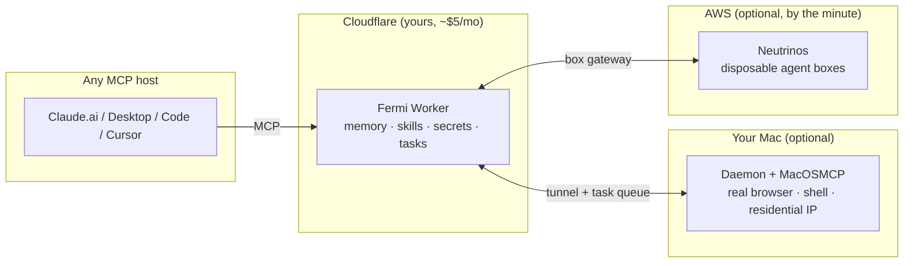

## The three-line pitch

You already pay for a frontier model. Fermi is the part the subscription doesn't give you: **a persistent self you control** — memory that survives the chat window, skills that crystallize from experience, credentials that stay yours, and compute that scales past one laptop.

Start with just the Worker. Add the Mac when you need hands. Add the fleet when you need a hundred of them.
