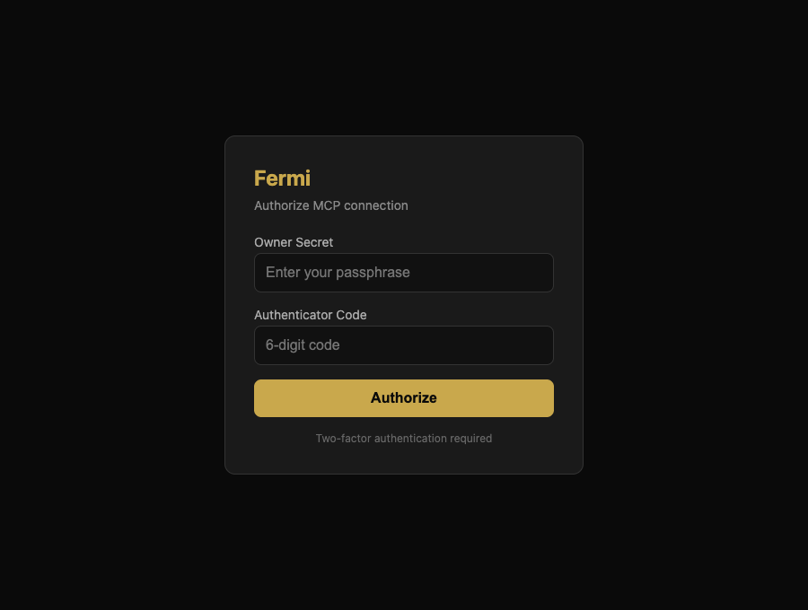

# Fermi — Usage

How to deploy, configure, connect, and operate a Fermi instance. Everything here
matches the behaviour in `packages/worker/src`; see
[`ARCHITECTURE.md`](ARCHITECTURE.md) for why it works the way it does.

---

## 1. Deploy

```bash
git clone <repo-url> fermi && cd fermi
bun install
wrangler login

chmod +x bootstrap.sh
./bootstrap.sh my-instance-name
```

`bootstrap.sh` creates the D1 database, R2 bucket, both KV namespaces, and the
Vectorize index for the current Cloudflare account, then renders
`packages/worker/wrangler.jsonc` from `wrangler.template.jsonc` with the generated
IDs. Nothing account-specific is committed to the repo.

Apply migrations and deploy:

```bash
cd packages/worker
wrangler secret put FERMI_SECRETS_KEY     # required — encrypts the secrets store
bun run migrate:remote
wrangler deploy
```

Verify it's live:

```bash
curl https://<worker>/health
# {"status":"ok","name":"fermi"}
```

---

## 2. Choose an auth mode

Auth is controlled by the `FERMI_AUTH_ENABLED` var (set it in `wrangler.jsonc`
`vars`, or via `wrangler deploy --var`).

**Open mode (default).** `FERMI_AUTH_ENABLED` unset or not `"true"`. `/mcp` and `/sse`
are served with no transport authentication. Only use this with `wrangler dev` locally.

> ⚠️ **A deployed Worker is internet-exposed.** `wrangler deploy` publishes to a
> public `*.workers.dev` URL, and in open mode anyone who finds that URL gets full,
> unauthenticated access to every tool — your memories, stored secrets
> (`secret_resolve`), code execution (`execute`), and browser sessions. Enable OAuth
> mode before (or immediately after) your first deploy.

**OAuth mode.** `FERMI_AUTH_ENABLED="true"`. The MCP transports are wrapped by an
OAuth provider; the consent screen validates `FERMI_OWNER_SECRET` (and a TOTP code if
you've set one up). Use this for any deployed instance.

```bash
wrangler secret put FERMI_OWNER_SECRET    # owner password for the consent screen
```

When a host connects (e.g. adding the connector in Claude.ai), it registers itself
via dynamic client registration (`/oauth/register`) and redirects you to Fermi's
consent screen. Enter your owner secret — and your authenticator code once TOTP is
set up via the `totp_setup` tool — and the host receives its tokens automatically.
No identity provider to configure; this screen *is* the login:



Admin HTTP endpoints are always gated by a bearer token, independent of the mode
above:

```bash
wrangler secret put FERMI_BEARER_TOKEN
```

---

## 3. Seed skills and inspect capabilities

The five bundled skills (`github-api`, `totp-oauth`, `browser-auth-spa`,
`aws-cdk-discipline`, `shopify-admin`) load idempotently:

```bash
curl -X POST https://<worker>/admin/seed-skills \
  -H "Authorization: Bearer $FERMI_BEARER_TOKEN"
```

List the sandbox capability registry (the 39 capabilities `execute` can reach):

```bash
curl https://<worker>/capabilities \
  -H "Authorization: Bearer $FERMI_BEARER_TOKEN"
```

From a connected host you can get the same list with the `meta_list_capabilities`
tool, and aggregate usage with `usage_stats`.

---

## 4. Connect a host

| Host | How |
|------|-----|
| Claude.ai (web) | Settings → Connectors → add custom connector → `https://<worker>/sse` |
| Claude Desktop | `mcpServers` entry with `"url": "https://<worker>/mcp"` |
| Claude Code | `claude mcp add fermi --transport http https://<worker>/mcp` |
| Cursor / VS Code | `{ "fermi": { "url": "https://<worker>/mcp" } }` |

`/mcp` is the streamable-HTTP transport; `/sse` is the legacy SSE transport kept for
clients (such as Claude.ai connectors) that expect it.

---

## 5. Working with the core tools

### Memory

```jsonc
// store
memory_write({ kind: "preference", body: "Deploys go out Tuesday mornings.", pinned: true })
// recall (keyword match, pinned first)
memory_recall({ query: "deploy", limit: 5 })
// list newest
memory_list_recent({ limit: 10 })
// edit / soft-delete
memory_update({ id: 42, patch: { body: "..." } })
memory_delete({ id: 42 })
```

Pinned memories are never decayed by the nightly consolidation job. Unpinned
memories decay after 90 days or when a near-duplicate is found.

### Skills

For any "how do I…" / procedural question, search skills **before** memory:

```jsonc
skill_search({ query: "github" })
skill_load({ slug: "github-api" })   // returns SKILL.md + allowed_tools; bumps usage_count
```

Author a skill, or promote one from a memory:

```jsonc
skill_set({
  slug: "deploy-runbook",
  body: "---\nname: Deploy runbook\nkeywords: [deploy, release]\n---\n1. ...",
  origin_memory_id: 42        // optional: records source = promoted_from_memory
})
```

### Unified search

```jsonc
// ranked search across capabilities, skills, memories, messages
search({ query: "shopify auth", limit: 10 })
// restrict the candidate types
search({ query: "browser", types: ["capability", "skill"] })
// exact entity lookup
search({ entity: "github-api:skill" })
```

The response includes `matches`, an `offline` flag (true if the semantic lane fell
back to the non-semantic hash embedding), `warnings`, and
`telemetry.candidateCounts`.

### Code mode (`execute`)

`execute` runs JavaScript in an isolated sandbox where capabilities are
`codemode.<name>(...)`. It is high-risk, so the first call returns an approval token
and you re-invoke with it:

```jsonc
execute({ code: `
  const hits = await codemode.memory_recall({ query: "release", limit: 3 });
  return hits.length;
` })
// → { status: "pending_approval", token: "..." }
execute({ code: "...same code...", approval_token: "<token>" })
```

The sandbox has no raw `fetch`. To call an HTTP API, use the `fetch_url` capability,
which routes through the gateway and expands `{{secret:NAME}}` placeholders:

```js
const res = await codemode.fetch_url({
  url: "https://api.github.com/user",
  headers: { Authorization: "Bearer {{secret:GITHUB_TOKEN}}" }
});
```

### Secrets

```jsonc
// store (high-risk → approval-gated), scoped to a host
secret_set({
  name: "GITHUB_TOKEN", value: "ghp_...",
  allowed_hosts: ["api.github.com"]
})
// metadata only — never returns plaintext
secret_list({})
```

To use a secret for in-sandbox crypto (SRP, HMAC, JWT) rather than gateway
injection, opt it in explicitly and resolve it:

```jsonc
secret_set({ name: "SIGNING_KEY", value: "...", allowed_capabilities: ["secret_resolve"] })
```
```js
const key = await codemode.secret_resolve({ name: "SIGNING_KEY", scope: "app", purpose: "HMAC" });
```

`secret_resolve` is rate-limited to 10 calls/min per session and every call is
audited.

### Plan mode

```jsonc
session_set_mode({ mode: "plan" })   // mutating tools now blocked
plan_draft({ steps: ["...", "..."] })
plan_approve({ plan_id: "..." })
session_set_mode({ mode: "execute" })
```

In `plan` mode the only mutating tools allowed are `plan_draft`, `plan_approve`, and
`session_set_mode`.

### Hooks

Register a deny-gate that blocks a tool by glob:

```jsonc
hooks_register({ event: "tool:before", matcher: "secret_*", trust_level: "deny" })
hooks_test({ event: "tool:before", tool_name: "secret_delete" })  // dry run
hooks_list({})
```

Only `tool:before` / `tool:after` are dispatched today, and only the `deny` decision
is enforced. The `command` field is recorded but not executed.

### Browser

Cloud lane (one-shot and scripted):

```jsonc
browser_extract({ url: "https://example.com", selector: "main" })
browser_action({ actions: [
  { type: "goto", url: "https://example.com/login" },
  { type: "type", selector: "#user", text: "me" },
  { type: "type", selector: "#pass", text: "{{secret:SITE_PASS}}" },
  { type: "click", selector: "button[type=submit]" },
  { type: "screenshot" }
]})
```

Persistent session with human-in-the-loop:

```jsonc
const { session_id, live_view_url } = browser_session_launch({ label: "billing" })
browser_session_action({ session_id, actions: [ ... ] })
browser_session_request_human({ session_id, message: "solve the captcha" })  // returns live_view_url
browser_session_resume({ session_id })
browser_session_close({ session_id })
```

Local lane (macOS bridge) — only available when `MACOS_MCP_URL` is configured; see
section 7.

### Subagents

```jsonc
team_spawn({ role: "verifier", instructions: "Try to break the login flow we just built." })
```

The role sets the subagent's system prompt; it runs the same inference loop as the
channels. Concurrency is capped (default 3).

---

## 6. Channels (Telegram / Discord / WhatsApp / Slack)

Channels let you talk to the agent with no MCP host attached. Inbound messages
enqueue onto a D1 task queue; a Mac-local daemon drains them (`task_claim` →
work → `channel_send`). Slack is a Socket Mode bridge (`packages/sl-bridge`),
not an in-worker inference loop.

```bash
wrangler secret put TELEGRAM_BOT_TOKEN
wrangler secret put TELEGRAM_WEBHOOK_SECRET
wrangler secret put DISCORD_BOT_TOKEN
wrangler secret put DISCORD_BRIDGE_SECRET
wrangler secret put SLACK_BOT_TOKEN
wrangler secret put SLACK_BRIDGE_SECRET
wrangler secret put WA_WEBHOOK_SECRET
```

Telegram POSTs to `https://<worker>/tg/webhook`. Discord and Slack bridges POST
to `/dc/webhook` and `/sl/webhook`. See [`packages/sl-bridge/README.md`](../packages/sl-bridge/README.md)
for the Slack app (Socket Mode + `xapp-` token on the daemon).

The daily brief posts to whichever channel is configured in KV
(`config:daily_brief:channel`, `config:daily_brief:chat_id`, and for Slack
`config:daily_brief:slack_channel`).

---

## 7. Optional: the macOS bridge (local browser + desktop control)

The bridge is a separate MCP server you run on a Mac, exposed to the Worker over a
Cloudflare Tunnel. Set:

```bash
wrangler secret put MACOS_MCP_URL     # tunnel URL of the Mac MCP server
wrangler secret put MACOS_MCP_TOKEN   # bearer token the bridge expects
```

With these set, the Worker registers 25 `mac_*` tools (shell/AppleScript/JXA, file
ops, a real stealth Chrome, screenshot + OCR, clipboard, keystroke/click, app
control, notifications). Without them, those tools are simply absent. If the Mac is
offline, calls return `{ "error": "agent_offline" }` instead of failing the request.

Use this lane when a site blocks datacentre IPs/headless browsers and you need a real
hardware fingerprint and residential network.

---

## 8. Optional: outbound phone calls (Twilio + GPT-Live)

`phone_call_start` places a real call through Twilio and hands the conversation to
OpenAI's GPT-Live voice model with a goal ("call the IRS, wait on hold, request a
first-time penalty abatement"). One `PhoneCallDO` per call bridges a Twilio
bidirectional media stream (μ-law) to GPT-Live, navigates phone menus (`send_dtmf`),
and **closes the GPT-Live session while on hold** — it re-opens only when a person
picks up (speech burst followed by silence), replaying the greeting.

Configure with `secret_set` (scope `app`) from any host — no redeploy needed — or as
Worker vars/secrets of the same name:

| Name | Value |
|------|-------|
| `TWILIO_ACCOUNT_SID` | Twilio account SID |
| `TWILIO_AUTH_TOKEN` | Twilio auth token; also verifies the signature on `/phone/webhook` |
| `TWILIO_FROM_NUMBER` | caller id, E.164: a Twilio number, or a number you own that is a Verified Caller ID |
| `OPENAI_API_KEY` | OpenAI key with GPT-Live access |
| `FERMI_PUBLIC_URL` | `https://<worker>` — Twilio connects to `/phone/stream/<call_id>/<token>` and posts to `/phone/webhook` |
| `OPENAI_LIVE_MODEL`, `OPENAI_LIVE_BACKEND_MODEL`, `OPENAI_LIVE_VOICE` | optional (defaults `gpt-live-1`, `gpt-6-luna`, `marin`) |

A Twilio **trial** account only calls verified numbers and plays a trial notice the
callee must acknowledge; upgrade the account for real use.

`phone_call_start` is `risk: high` (re-invoke with the approval token). It returns a
`call_id` at once; the call runs on its own for up to `max_minutes`. Follow it with
`phone_call_status` (`wait_seconds` long-polls), stop it with `phone_call_hangup`. Pass
`notify_channel` + `notify_chat_id` and the outcome, summary, and transcript are
enqueued as a `phone:<call_id>` task for that chat when the call ends, so the daemon
reports back even if the lane that started the call is long gone.

Pressing a menu key replaces the call's TwiML with `<Play digits>` followed by a new
`<Connect><Stream>`, so the media stream reconnects (a 1–2 s audio gap) after each
`send_dtmf`.

Cost: GPT-Live bills per second of open session (hold time is free), plus Twilio
per-minute and the backend model's tool calls.

### Local test without a carrier

`packages/worker/scripts/phone-sim.mjs` stands in for Twilio: it serves the call
create/update endpoints, sends signed status callbacks, and streams a scripted callee
(phone menu, hold music, then a human) into the worker over the media WebSocket.
GPT-Live is real, so a run costs a few cents. Needs macOS `say` and `ffmpeg`.

```bash
cd packages/worker
mkdir -p /tmp/fermi-phone-sim
cat > /tmp/fermi-phone-sim/dev.env <<EOF
FERMI_SECRETS_KEY=$(openssl rand -hex 32)
FERMI_PUBLIC_URL=http://127.0.0.1:8787
TWILIO_API_BASE=http://127.0.0.1:8899
TWILIO_ACCOUNT_SID=ACsim
TWILIO_AUTH_TOKEN=sim-token
TWILIO_FROM_NUMBER=+15550001111
OPENAI_API_KEY=sk-...
EOF
STATE=/tmp/fermi-phone-sim/state
wrangler d1 migrations apply FERMI_DB --local --persist-to $STATE --config wrangler.phone-sim.jsonc
wrangler dev --local --config wrangler.phone-sim.jsonc --persist-to $STATE \
  --env-file /tmp/fermi-phone-sim/dev.env &
node scripts/phone-sim.mjs                        # prints PASS/FAIL checks + transcript
```

It writes a stereo recording (left = callee, right = agent) and the full call record
to `/tmp/fermi-phone-sim/`.

---

## 9. Operations

### Scheduled jobs

Configured in `wrangler.template.jsonc` `triggers.crons`:

| Cron | Job |
|------|-----|
| `0 3 * * *` | Session summarization + memory de-dup + decay |
| `0 8 * * *` | Daily brief to the configured channel |
| `0 2 * * SUN` | Propose draft skills from recent session summaries |
| `0 */6 * * *` | Re-embed capabilities + skills into Vectorize |

The reindex job is also reachable on demand:

```bash
curl -X POST https://<worker>/cron/capability-reindex \
  -H "Authorization: Bearer $FERMI_BEARER_TOKEN"
```

### Telemetry

`usage_stats` aggregates the D1 audit log — call counts, success vs. denied,
result payload sizes, estimated tokens, and durations — over a window
(`since: "7d"`, etc.). Use it to find expensive or unused tools.

### Approval tokens

High-risk tools (`execute`, `secret_set`, `secret_delete`, `secret_approve_host`,
the high-risk `mac_*` tools, `browser_action`/`browser_session_action`) return a
`pending_approval` token on first call. Tokens live in KV for 300 seconds and are
single-use. Re-invoke the same tool with `approval_token` to proceed.

---

## 10. Troubleshooting

| Symptom | Likely cause |
|---------|--------------|
| `search` returns `offline: true` | Workers AI embeddings unavailable; the semantic lane fell back to the hash embedding. Keyword/FTS results still return. |
| `mac_*` tools missing | `MACOS_MCP_URL` not set, so the bridge isn't registered. |
| `mac_*` returns `agent_offline` | The Mac bridge is unreachable; check the tunnel and `MACOS_MCP_TOKEN`. |
| `pending_approval` on every call | Expected for high-risk tools — re-invoke with the returned `approval_token`. |
| Admin endpoint returns 401 | Missing or wrong `Authorization: Bearer $FERMI_BEARER_TOKEN`. |
| Channels don't respond | `ANTHROPIC_API_KEY` not set, or the webhook isn't pointed at the Worker. |
| Mutating tool denied with `plan_mode_restricted` | Session is in plan mode; `session_set_mode({ mode: "execute" })`. |
</content>
